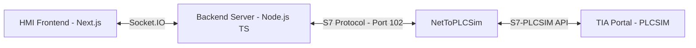

# Hệ Thống HMI & Backend Giám Sát Máy Ấp Trứng (S7-1200 / PLCSIM)

Hệ thống HMI giám sát và điều khiển Máy Ấp Trứng thời gian thực, kết nối tới Siemens S7-1200 PLC thông qua giao thức **S7 Protocol** sử dụng **NetToPLCSim**.

## 🏗️ Kiến Trúc Hệ Thống



---

## 🛠️ Yêu Cầu Hệ Thống

### Phần cứng / Phần mềm Mô phỏng:
* **TIA Portal** (V15, V16, V17, V18, hoặc V19)
* **S7-PLCSIM**
* **NetToPLCSim** (Công cụ chuyển tiếp mạng sang PLCSIM)
* **Node.js** (Phiên bản >= 18)

---

## 🚀 Hướng Dẫn Các Bước Chạy Hệ Thống

### Bước 1: Cấu hình trên TIA Portal & PLCSIM

1. Mở Project TIA Portal của bạn.
2. Truy cập vào **Properties** của PLC CPU 1214C -> **Protection & Security** -> **Connection mechanisms** -> Tích chọn **"Permit access with PUT/GET communication from remote partner"**. (BẮT BUỘC để cho phép đọc/ghi dữ liệu từ bên ngoài).
3. Biên dịch (`Compile`) toàn bộ dự án và nạp code xuống **S7-PLCSIM**. Đảm bảo PLCSIM đang ở chế độ **RUN**.

### Bước 2: Thiết lập NetToPLCSim

> [!IMPORTANT]  
> NetToPLCSim cần quyền Admin để chiếm dụng và chuyển tiếp luồng dữ liệu trên cổng 102.

1. Tải và giải nén **NetToPLCSim**.
2. Nhấp chuột phải vào file `NetToPLCSim.exe` chọn **Run as Administrator**.
3. Nếu hệ điều hành Windows hỏi có muốn tắt dịch vụ Siemens S7DOS (chiếm cổng 102) không, hãy chọn **Yes**.
4. Chọn **Add** để tạo trạm mới:
   * **Network IP Address**: Chọn IP LAN máy tính của bạn (Ví dụ: `192.168.1.50` hoặc `127.0.0.1`).
   * **Plcsim IP Address**: Chọn địa chỉ IP của PLC mô phỏng trong TIA Portal.
   * **Plcsim Rack/Slot**: Chọn `0` và `1` (Dành cho S7-1200).
5. Nhấn **Start Server**. Trạng thái của NetToPLCSim phải chuyển thành **RUNNING**.

---

### Bước 3: Khởi chạy Backend Server

Backend chịu trách nhiệm duy trì kết nối S7 đến NetToPLCSim và chia sẻ dữ liệu thời gian thực đến giao diện Web qua Socket.IO.

1. Di chuyển vào thư mục `backend`:
   ```bash
   cd backend
   ```
2. Cài đặt các thư viện cần thiết (nếu chưa cài):
   ```bash
   npm install
   ```
3. Chạy Backend ở chế độ phát triển:
   ```bash
   npm run dev
   ```
   *Cổng mặc định: `http://localhost:3001`*

---

### Bước 4: Khởi chạy Giao diện HMI (Frontend)

HMI Web viết bằng Next.js + Tailwind CSS sẽ kết nối đến Socket của Backend để hiển thị đồ họa và nút nhấn.

1. Di chuyển vào thư mục `frontend`:
   ```bash
   cd ../frontend
   ```
2. Cài đặt các thư viện cần thiết:
   ```bash
   npm install
   ```
3. Chạy Frontend:
   ```bash
   npm run dev
   ```
4. Truy cập giao diện trên trình duyệt tại địa chỉ: [http://localhost:3000](http://localhost:3000)

---

## 🔴 Khắc Phục Lỗi Kết Nối (`ECONNREFUSED 127.0.0.1:102`)

Nếu chạy backend bạn gặp lỗi:
`❌ Lỗi kết nối tới PLC: Error: connect ECONNREFUSED 127.0.0.1:102`

Hãy kiểm tra lần lượt các nguyên nhân sau:
1. **NetToPLCSim chưa chạy** hoặc chưa nhấn **Start Server**.
2. **Cổng 102 bị chiếm dụng** bởi dịch vụ `s7oiehsx` (SIMATIC S7DOS Help Service) của Siemens.
   * **Khắc phục**: Mở Task Manager -> Services -> Tìm dịch vụ `s7oiehsx` (hoặc `s7oiehsx64`) -> Click chuột phải chọn **Stop**. Sau đó tắt NetToPLCSim đi và mở lại bằng quyền **Run as Administrator** rồi nhấn **Start Server**.
3. **Cấu hình IP trong `backend/services/plcService.ts`**:
   * Đảm bảo giá trị `host` khớp với **Network IP Address** bạn đặt trong NetToPLCSim.
